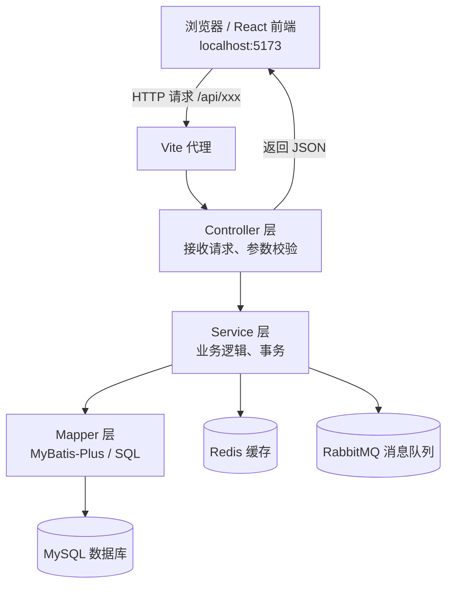
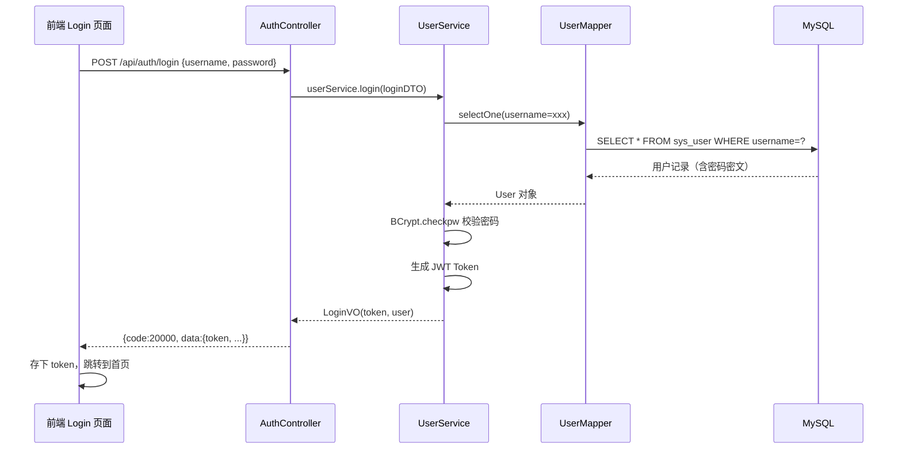
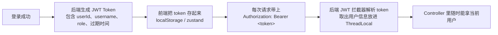
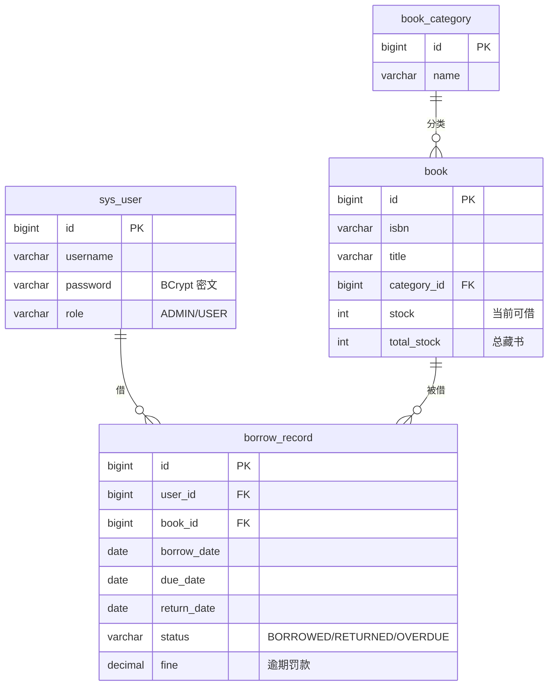

# 图书管理系统 · 初学者学习指南

> 一份写给**刚开始学这个项目的人**的文档。
> 不求一次看完，跟着"动手"和"顺着一次请求走"的方式，逐步把整个项目串起来。

---

## 目录

1. [这个项目是做什么的](#1-这个项目是做什么的)
2. [学习前：你会什么、不会什么](#2-学习前你会什么不会什么)
3. [第一步：把项目跑起来](#3-第一步把项目跑起来)
4. [架构总览：一次请求的完整旅程](#4-架构总览一次请求的完整旅程)
5. [后端：跟着一次登录请求学](#5-后端跟着一次登录请求学)
6. [后端核心概念逐个拆](#6-后端核心概念逐个拆)
7. [前端：跟着页面学](#7-前端跟着页面学)
8. [数据库设计](#8-数据库设计)
9. [建议的学习路线](#9-建议的学习路线)
10. [初学者最容易踩的坑](#10-初学者最容易踩的坑)
11. [动手小练习（检验你有没有真懂）](#11-动手小练习检验你有没有真懂)

---

## 1. 这个项目是做什么的

**一句话**：一个"图书管理系统"，管理员可以管图书、管分类、看所有借阅记录；普通用户可以注册登录、查书、借书、还书。前后端分离：后端提供接口（Spring Boot），前端做页面（React）。

**具体能干什么**：

| 角色 | 能做的事 |
|------|----------|
| 游客 | 注册账号、登录 |
| 普通用户 | 浏览图书、借书、还书、看自己的借阅记录 |
| 管理员 | 新增/修改/删除图书、管理分类、查看所有人的借阅记录 |

**技术栈一览**（先混个脸熟，后面逐个学）：

| 层 | 技术 | 干什么用的 |
|----|------|-----------|
| 前端框架 | React 18 + TypeScript | 写页面 |
| 前端 UI | Ant Design 5 | 现成的按钮、表格、表单组件 |
| 前端构建 | Vite | 开发服务器、打包 |
| 后端框架 | Spring Boot 3.2 | 提供 HTTP 接口 |
| ORM | MyBatis-Plus | 用 Java 代码操作数据库，不用手写 SQL |
| 数据库 | MySQL 8 | 存数据 |
| 缓存 | Redis | 缓存图书详情、分布式锁防超卖 |
| 消息队列 | RabbitMQ | 异步发通知（借书成功、到期提醒） |
| 认证 | JWT + BCrypt | 登录后发令牌，密码加密存储 |

---

## 2. 学习前：你会什么、不会什么

**你最好已经会**：

- Java 基础：类、接口、继承、注解、`@Override` 这种（不需要精通）
- 一点 SQL：`SELECT / INSERT / UPDATE / DELETE`、表、主键
- 一点 Web 常识：HTTP、GET/POST、JSON、浏览器地址栏
- 会看英文报错（大多数学习资料和报错都是英文）

**你不需要**：

- ❌ 不需要会 Spring Boot —— 这份文档就是带你入门
- ❌ 不需要会 React —— 前端部分只要求"看得懂大概"
- ❌ 不需要背框架 API —— 遇到不懂的，看代码、查官方文档即可

> 心态：学这个项目不是"背 API"，而是理解**一件事是怎么从"前端点击"变成"数据库里的一条数据"**的。抓住这条主线，其他都是细节。

---

## 3. 第一步：把项目跑起来

> 先把项目跑起来，边看边学才有感觉。跑不起来会极大打击信心，所以放在最前面。

### 3.1 需要的东西

| 软件 | 用途 | 本项目怎么提供 |
|------|------|---------------|
| JDK 17 | 编译运行 Java | 电脑已装 |
| Docker | 一键启动 MySQL/Redis/RabbitMQ | `docker-compose.yml` |
| Node.js | 运行前端 | 需要你装（`node -v` 检查） |

### 3.2 启动后端

> ⚠️ **所有命令必须在项目根目录 `library-management\` 下执行**（即 `pom.xml`、`docker-compose.yml`、`mvnw.cmd` 所在的目录）。
>
> 如果你在 `new-chat\` 目录，先执行 `cd library-management` 进入项目根目录。

```powershell
# 0. 进入项目根目录（如果还没进去的话）
cd library-management

# ① 启动 Docker Desktop（双击打开，等它就绪，任务栏鲸鱼图标稳定）

# ② 在项目根目录，一条命令启动三个中间件（MySQL/Redis/RabbitMQ）
docker-compose up -d
# 首次会拉镜像，稍等一会；之后会快

# ③ 确认三个容器都 healthy（STATUS 列显示 healthy）
docker ps

# ④ 启动后端（在项目根目录执行，后端代码就在根目录 src/ 下）
.\mvnw.cmd spring-boot:run
```

看到 `图书管理系统启动成功！` 就说明后端起来了。

> 💡 后端启动后不要关闭这个终端窗口，关闭就等于停掉后端。

### 3.3 启动前端

> ⚠️ **前端命令在项目根目录下的 `frontend\` 子目录执行**。先确保你在 `library-management\` 目录，再 `cd frontend`。
>
> 后端启动的终端窗口不要关，**新开一个终端窗口**启动前端。

```powershell
# 0. 先确认在项目根目录 library-management\ 下，然后进入前端目录
cd library-management\frontend

# ① 首次安装依赖（会生成 node_modules，只需执行一次，以后不用再装）
npm install

# ② 启动开发服务器
npm run dev
```

浏览器会自动打开 `http://localhost:5173`，看到登录页。

> 💡 如果 `npm install` 很慢，可以切换淘宝镜像：`npm config set registry https://registry.npmmirror.com`，然后再执行 `npm install`。

### 3.4 第一次体验

1. 注册一个账号（或直接用管理员 `admin / admin123`）
2. 登录进去，试试"图书管理"页面，点"借书"、"还书"
3. 打开接口文档 `http://localhost:8080/api/doc.html`，这是后端的"说明书"，能看到所有接口、能直接调试

> 💡 现在你什么都不懂也没关系，先感受一下"前端页面 → 后端接口 → 数据库"这三层是怎么配合的。

---

## 4. 架构总览：一次请求的完整旅程

这是整个项目**最重要的一张图**。记住它，后面所有内容都是在给它加细节。



**一次"登录"请求的完整旅程**（这是贯穿全文的例子，务必看懂）：



**各层一句话职责**：

| 层 | 包 | 职责 | 类比 |
|----|-----|------|------|
| Controller | `controller/` | 收请求、验参数、返回结果 | 前台服务员 |
| Service | `service/` | 真正干活：业务规则、事务 | 后厨厨师 |
| Mapper | `mapper/` | 跟数据库打交道 | 采购员 |
| Entity | `entity/` | 数据库表的 Java 对象 | 一张表的"模型" |
| DTO | `dto/` | 接收前端传来的参数 | 点菜单 |
| VO | `vo/` | 返回给前端的对象 | 端上桌的菜 |

---

## 5. 后端：跟着一次登录请求学

我们顺着登录请求，把后端每一层都看一遍。**看的时候打开项目里的对应文件，边看边对**。

### 5.1 前端先发一个请求（`frontend/src/pages/Login.tsx` + `api/auth.ts`）

前端点击"登录"按钮后，`api/auth.ts` 里调用了：

```ts
export function login(data: { username: string; password: string }) {
  return post('/auth/login', data)   // 实际发出 POST /api/auth/login
}
```

浏览器里看不到后端地址（`8080`）——因为 `vite.config.ts` 里配了代理：**前端发 `/api` 开头的请求，Vite 自动转发到 `http://localhost:8080`**。所以开发时前端始终只写 `/api/xxx`，不用管后端在哪。

### 5.2 Controller 层接收（`src/.../controller/AuthController.java`）

```java
@Tag(name = "认证管理")
@RestController
@RequestMapping("/auth")
@RequiredArgsConstructor
public class AuthController {

    private final UserService userService;

    @PostMapping("/login")
    public Result<LoginVO> login(@Valid @RequestBody LoginDTO loginDTO) {
        LoginVO loginVO = userService.login(loginDTO);
        return Result.success(loginVO);
    }
}
```

- `@RestController`：这个类是"接口"，接收 HTTP 请求
- `@PostMapping("/login")` + 类上的 `@RequestMapping("/auth")` = 完整路径 `/auth/login`
- `@RequestBody LoginDTO`：把请求体里的 JSON 自动变成 Java 对象（`LoginDTO`）
- `@Valid`：触发 DTO 上的校验注解（如 `@NotBlank`），参数不合法直接报错，不用自己写判断
- 返回 `Result<LoginVO>`：统一的返回格式，前端好判断成功失败

> 初学者常问：**为什么不用 `Map` 直接接收？** 因为用 DTO 可以加校验注解（`@NotBlank` 等）、类型安全、代码可读性好。详见 6.1。

### 5.3 Service 层干活（`src/.../service/impl/UserServiceImpl.java`）

```java
@Slf4j
@Service
@RequiredArgsConstructor
public class UserServiceImpl extends ServiceImpl<UserMapper, User> implements UserService {

    private final JwtUtil jwtUtil;

    @Override
    public LoginVO login(LoginDTO loginDTO) {
        // 1. 按用户名查用户
        User user = getByUsername(loginDTO.getUsername());
        if (user == null) {
            throw new BusinessException(ResultCode.USERNAME_NOT_FOUND);
        }

        // 2. 检查账号状态（0=禁用）
        if (user.getStatus() != null && user.getStatus() == 0) {
            throw new BusinessException(ResultCode.USER_DISABLED);
        }

        // 3. 校验密码（密文比对）
        if (!BCrypt.checkpw(loginDTO.getPassword(), user.getPassword())) {
            throw new BusinessException(ResultCode.PASSWORD_ERROR);
        }

        // 4. 生成 JWT Token
        String token = jwtUtil.generateToken(user.getId(), user.getUsername(), user.getRole());

        // 5. 构建登录响应
        return LoginVO.builder()
                .token(token)
                .tokenPrefix(tokenPrefix)
                .expiresIn(expiration)
                .user(toVO(user))
                .build();
    }
}
```

Service 是**业务逻辑的核心**：查用户 → 验密码 → 发令牌。业务规则（密码不对怎么办、用户不存在怎么办）都在这一层。

### 5.4 Mapper 层查库（`src/.../mapper/UserMapper.java`）

```java
@Mapper
public interface UserMapper extends BaseMapper<User> {
    // 空接口也能用！BaseMapper 提供了全套 CRUD
}
```

`UserMapper` 是接口，**没有实现类**——MyBatis-Plus 启动时自动生成实现。继承 `BaseMapper<User>` 就有了 `selectById`、`insert`、`updateById`、`deleteById` 等十几个现成方法，不用写 SQL。

上面 `getByUsername()` 里用 `LambdaQueryWrapper` 构建条件，再调 `getOne()`（底层就是 `selectOne`），最终执行：

```sql
SELECT * FROM sys_user WHERE username = 'admin' AND deleted = 0
```

### 5.5 Entity 层（`src/.../entity/User.java`）

```java
@Data
@TableName("sys_user")
public class User implements Serializable {
    @TableId(type = IdType.AUTO)
    private Long id;

    private String username;
    private String password;   // 存的是 BCrypt 密文，不是明文！
    private String nickname;
    private String role;       // ADMIN / USER
    // ... createTime, updateTime, deleted 等
}
```

- `@TableName("sys_user")`：这个类对应数据库表 `sys_user`
- `@TableId(type = IdType.AUTO)`：`id` 是自增主键
- `@Data`：自动生成 getter/setter 等（Lombok）
- `deleted` 字段：逻辑删除（见 6.4）

### 5.6 返回给前端（VO + Result）

- `LoginVO`：返回 token + 用户信息
- `Result`：统一包装，格式 `{code, message, data, timestamp}`，前端响应拦截器靠 `code === 20000` 判断成功

---

## 6. 后端核心概念逐个拆

### 6.1 DTO / Entity / VO 到底什么区别

一个请求里同时出现三种对象，初学者最容易晕。一句话记住：

| 对象 | 方向 | 一句话 | 例子 |
|------|------|--------|------|
| **DTO** | 前端 → 后端 | "前端给我的数据"，带校验注解 | `LoginDTO{username, password}` |
| **Entity** | 后端 ↔ 数据库 | "数据库里的一行"，对应表 | `User` |
| **VO** | 后端 → 前端 | "我返回给前端的数据"，藏敏感字段 | `UserVO`（**没有** password） |

**为什么不能用 Entity 直接返回？** 因为 `User` 有 `password` 字段，直接返回就把密码密文发给前端了。所以 Service 里有个 `toVO(user)` 方法，拷贝时自然丢弃 password。

**为什么不能用 Entity 直接接收？** 因为前端传的参数和数据库字段不完全一样，且新增/更新时的校验规则不同，分开定义更灵活。

> 代码里 `BeanUtils.copyProperties(source, target)` 按同名属性自动拷贝，就是做 DTO/Entity/VO 之间转换的。

### 6.2 MyBatis-Plus：让 CRUD 不用写 SQL

传统写法：每个操作写一条 SQL + 一个 Mapper 方法。MyBatis-Plus 的做法：

```java
// 不用写 SQL 就能：
userService.save(user);            // 插入
userService.getById(1L);           // 按 id 查
userService.updateById(user);      // 按 id 更新
userService.removeById(1L);        // 逻辑删除
userService.list();                // 查全部
```

复杂查询用 `LambdaQueryWrapper`（条件构造器）：

```java
LambdaQueryWrapper<Book> wrapper = new LambdaQueryWrapper<>();
wrapper.like(Book::getTitle, "Java");          // WHERE title LIKE '%Java%'
wrapper.gt(Book::getStock, 0);                 //   AND stock > 0
wrapper.orderByDesc(Book::getCreateTime);      // ORDER BY create_time DESC
```

### 6.3 JWT：登录后怎么"记住"你是谁

HTTP 是无状态的，每次请求服务端都不知道你是谁。JWT 解决这个问题：



- 前端：`request.ts` 的请求拦截器自动加 `Authorization: Bearer <token>` 头
- 后端：`JwtInterceptor` 拦截请求，校验 token 是否有效、有没有过期
- `UserContext`：用 ThreadLocal 存"当前登录用户"，借书时直接 `UserContext.getCurrentUserId()` 拿 userId

### 6.4 逻辑删除：为什么表里都有 `deleted` 字段

物理删除 = 真的把数据删掉；逻辑删除 = 打个标记（`deleted=1`），数据还在库里。

```java
@TableLogic
private Integer deleted;   // 0=未删 1=已删
```

配上 `@TableLogic` 后：
- 你写 `removeById(1)`，实际执行 `UPDATE ... SET deleted=1`
- 你写 `selectById(1)`，实际执行 `SELECT ... AND deleted=0`（自动过滤已删除）

**好处**：借阅记录、图书这些数据删了还能恢复、还能统计历史，不会真丢。

### 6.5 Redis：缓存和分布式锁

**缓存**：图书详情是热点数据，每次都查 MySQL 太慢。`BookServiceImpl` 先查 Redis，没有再去查库并回填缓存：

```
查询图书详情：
  Redis 有？ ──> 直接返回（快）
  Redis 没有？ ──> 查 MySQL ──> 存进 Redis ──> 返回
```

**分布式锁**（防超卖）：借书时，两个用户同时借同一本书最后一本，可能都通过"库存>0"判断，导致库存变负数。`BorrowServiceImpl` 用 Redis 分布式锁保证同一本书的借阅是串行的：

```
lockKey = "library:lock:borrow:{userId}:{bookId}"
加锁成功才继续 → 扣库存 → 建记录 → 释放锁
```

> 初学者先记住"有这个东西、解决什么问题"，原理等学完 Spring 再深究。

### 6.6 RabbitMQ：异步消息

借书成功后要"发通知"、"到期提醒"，这些不需要用户等，可以异步做：

```
借书成功
  ├─ 立即返回给用户（不用等通知发完）
  └─ 后台异步：RabbitMQ 投递消息
       ├─ 通知消费者：发借书成功通知
       └─ 延迟队列：30 天后触发到期提醒
```

`MessageProducer` 发消息，`MessageConsumer` 收消息处理。这样主流程更快，也解耦。

### 6.7 事务：多个操作要么全成、要么全不成

借书涉及"扣库存 + 建借阅记录"两个操作。如果扣了库存但建记录失败，就出大事了（库存少了但没记录）。

`@Transactional(rollbackFor = Exception.class)` 保证这两个操作在一个事务里，任何一步失败，前面做的全部回滚：

```java
@Transactional(rollbackFor = Exception.class)
public BorrowRecordVO borrowBook(Long userId, Long bookId) {
    bookMapper.decreaseStock(bookId, 1);   // ① 扣库存
    this.save(record);                      // ② 建记录
    // ② 失败 → ① 自动回滚，库存恢复
}
```

### 6.8 异常处理：错误信息怎么统一返回

Service 里遇到业务错误直接**抛异常**，不用层层传错误码：

```java
if (user == null) {
    throw new BusinessException(ResultCode.USERNAME_NOT_FOUND);
}
```

`GlobalExceptionHandler`（`@RestControllerAdvice`）统一接住所有异常，转成 `Result` 返回，前端统一处理。这样 Controller 里很干净，不会每个方法都写 try-catch。

---

## 7. 前端：跟着页面学

### 7.1 项目结构

```
frontend/
├── src/
│   ├── main.tsx            # 入口：挂载 React
│   ├── App.tsx
│   ├── router/index.tsx    # 路由 + 登录守卫
│   ├── layouts/MainLayout  # 整体布局（侧边栏 + 内容区）
│   ├── pages/              # 每个页面一个文件
│   │   ├── Login.tsx       # 登录页
│   │   ├── Register.tsx
│   │   ├── Dashboard.tsx   # 首页/数据面板
│   │   ├── BookList.tsx    # 图书列表（查书/借书）
│   │   ├── CategoryList.tsx# 分类管理
│   │   ├── MyBorrows.tsx   # 我的借阅
│   │   └── AllBorrows.tsx  # 所有借阅（管理员）
│   ├── api/                # 封装的后端接口调用
│   │   ├── request.ts      # axios 封装（自动带 token、统一错误）
│   │   ├── auth.ts / book.ts / borrow.ts / category.ts
│   ├── store/userStore.ts  # 全局状态（zustand 存 token、用户信息）
│   ├── utils/auth.ts       # token 的存取删
│   └── types/index.ts      # TS 类型定义
```

### 7.2 一页里发生了什么（以登录页为例）

```
用户在输入框输入账号密码
        │
        ▼
onFinish 回调触发
        │
        ▼
调 api/auth.ts 的 login() → axios 发 POST /api/auth/login
        │
        ▼
后端返回 {code:20000, data:{token, user}}
        │
        ▼
request.ts 响应拦截器看到 code===20000 → 放行
        │
        ▼
Login.tsx 拿到结果：存 token → 跳转 /dashboard
```

### 7.3 三个初学者一定要懂的前端点

1. **路由**（`router/index.tsx`）：`/login` `/register` 是公开的；其他页面包在 `RequireAuth` 里，没登录就跳回 `/login`。
2. **请求拦截器**（`request.ts`）：每次请求自动带 `Authorization: Bearer <token>`，你不用在每个接口手动加。
3. **响应拦截器**（`request.ts`）：统一判断 `code`；遇到 `40100`（token 过期）自动清 token 并跳登录页。

---

## 8. 数据库设计

项目用了 5 张表：



**几个设计细节**（面试也常问）：

- **`stock` 和 `total_stock` 分开**：`stock` 是当前可借数量（借还时变），`total_stock` 是总藏书量（采购时变）。两者相减就是"借出去几本"。
- **金额用 `decimal`**：`fine` 是钱，用 `decimal`（对应 Java 的 `BigDecimal`），不用 `double`（浮点精度会丢）。
- **状态用字符串不用数字**：`BORROWED / RETURNED / OVERDUE` 比 `0 / 1 / 2` 可读性好太多。
- **每张表都有 `create_time / update_time / deleted`**：审计 + 逻辑删除，属于企业项目标配。

---

## 9. 建议的学习路线

按顺序学，**每个阶段都要动手**。仓库里已有配套的学习笔记：

| 阶段 | 学什么 | 动手做什么 | 配套资料 |
|------|--------|-----------|----------|
| **0. 跑起来**（半天） | 把项目跑起来，体验所有功能 | 注册/登录/借书/还书 | 本文第 3 节 |
| **1. 项目骨架**（1-2 天） | `pom.xml`、`application.yml`、启动类 | 改端口/改配置，重启观察 | `学习笔记/第一阶段-项目骨架详解.md` |
| **2. 分层架构**（2-3 天） | Entity/Mapper/Service/Controller、DTO/VO | 跟着登录请求走一遍 | `学习笔记/第二阶段-分层架构详解.md` |
| **3. 认证与权限**（1-2 天） | JWT、BCrypt、拦截器、UserContext | 自己加一个"只有管理员能看"的接口 | docs/01 第 5 节 |
| **4. 缓存与并发**（2-3 天） | Redis 缓存、分布式锁、事务 | 压测借书接口，观察库存是否正确 | docs/01 第 6 节 |
| **5. 消息队列**（2-3 天） | RabbitMQ 交换机/队列/死信/延迟 | 断网重启 RabbitMQ，看消息是否可靠 | docs/01 相关章节 |
| **6. 从 0 手写**（随缘） | 不看本项目，自己重新搭一遍 | 跟着步骤写一个迷你版 | `docs/03-从0开始手写步骤.md` |
| **7. 查漏补缺** | Java/Spring/MySQL 八股 | 刷题检验 | `docs/02-面试八股文大全.md` |

> **黄金法则**：每学一个新概念，就去代码里找到它、改一行、看效果。只读不写 = 白学。

---

## 10. 初学者最容易踩的坑

| # | 坑 | 现象 | 怎么解决 |
|---|----|------|----------|
| 1 | 中间件没起 | 后端启动报连不上 MySQL/Redis/RabbitMQ | `docker ps` 确认三个容器 healthy |
| 2 | 端口被占用 | 8080/5173 起不来 | `netstat -ano \| findstr :8080` 找到 PID 杀掉 |
| 3 | 数据库密码不一致 | 连不上 MySQL | `application.yml` 的密码要跟 docker-compose 里一致 |
| 4 | 前端请求 404 | 页面调接口失败 | 确认后端起来了、`/api` 代理对不对 |
| 5 | 接口 401 | 没带 token 或 token 过期 | 重新登录，在 doc.html 里把 token 填进 Authorize |
| 6 | 改了代码没生效 | 改完还是旧行为 | 重启后端（`bootRun`）/ 前端热更新看终端有没有报错 |
| 7 | 中文乱码 | 数据中文变 `?` | 确认 JDBC URL 带 `characterEncoding=utf8`、表用 utf8mb4 |
| 8 | 改数据库表没同步 | 查不到新字段 | MyBatis-Plus 映射的是实体类，表改了要同步改 Entity |

---

## 11. 动手小练习（检验你有没有真懂）

按难度递增，**做完一个再做一个**：

1. **改端口**：把后端端口改成 `9090`，前端代理也改过去，重新跑通。（检验：配置在哪、前端代理在哪）
2. **加一个接口**：给 `BookController` 加一个 `GET /books/count`，返回图书总数。（检验：Controller → Service → Mapper 链路）
3. **加一个字段**：给 `Book` 加一个"出版社地址"字段（表、Entity、DTO、VO、前端表单五处都改）。（检验：前后端数据流全链路）
4. **做一个管理员接口**：新写一个"只有管理员能看的统计接口"，普通用户访问返回 403。（检验：UserContext + 权限判断）
5. **读懂借书代码**：在 `BorrowServiceImpl.borrowBook` 里加注释，说明每一步在干什么。（检验：业务逻辑 + 并发 + 事务）
6. **画一张图**：不用看代码，自己画出"一次借书请求"从前端到数据库再回来的完整流程。（检验：整体架构是否真懂）

---

## 附：怎么继续深入

- **本项目配套文档**：`docs/01-知识点深度解析.md`（原理）、`docs/02-面试八股文大全.md`（面试）、`docs/03-从0开始手写步骤.md`（手写）、`学习笔记/`（阶段笔记）
- **官方文档**：Spring Boot / MyBatis-Plus / React / Vite 的官方文档是最好的老师
- **Debug 是最好的学习**：在后端方法里打断点（IDEA 里点行号），看数据一步步怎么走的，比看十遍文档都管用
